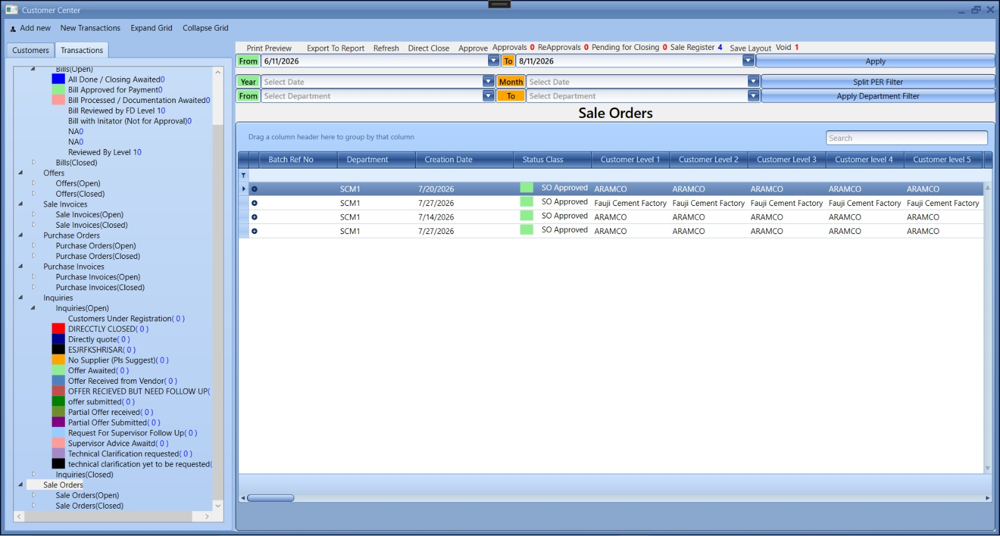
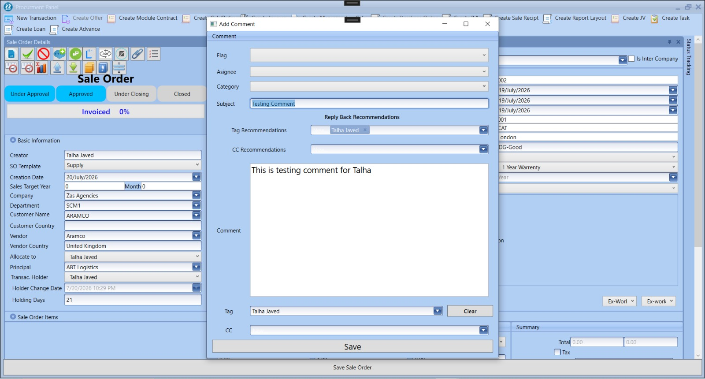
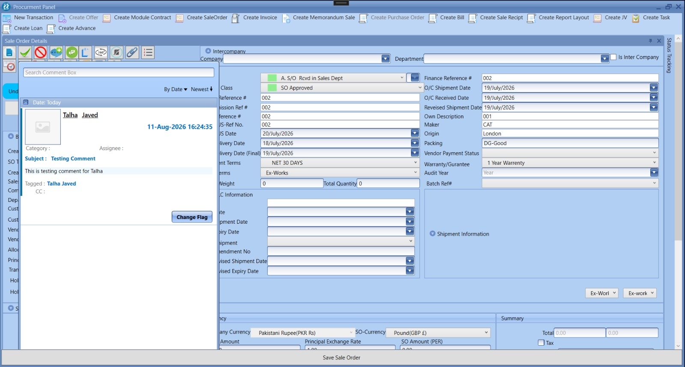
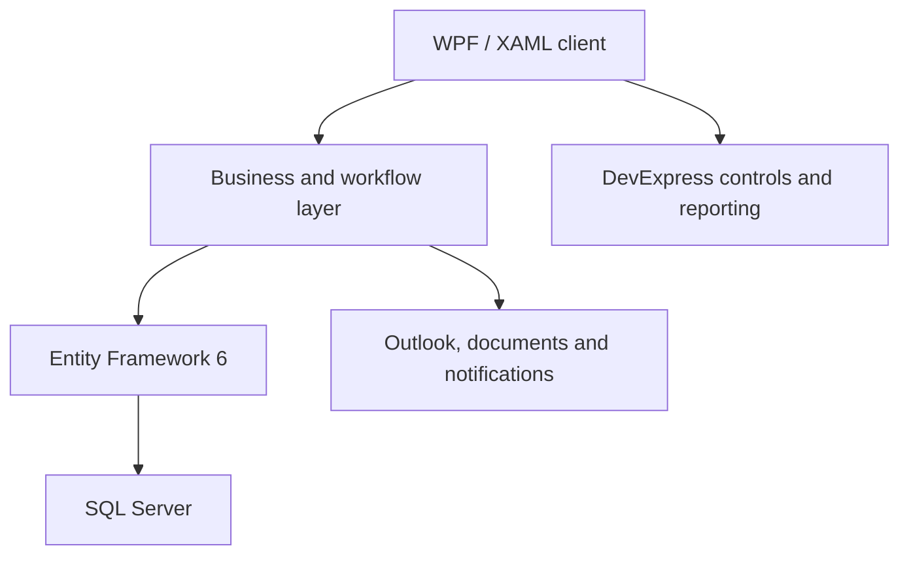

# SmartERP — Enterprise ERP Engineering Case Study

> A sanitized engineering portfolio describing seven years of hands-on work designing, developing, supporting, and modernising a multi-company ERP platform.

[](https://dotnet.microsoft.com/)
[](https://learn.microsoft.com/dotnet/desktop/wpf/)
[](https://learn.microsoft.com/ef/)
[](https://www.microsoft.com/sql-server)
[](#portfolio-scope)

## Executive summary

SmartERP is a bespoke enterprise resource planning platform that supported approximately **200–250 users** across **multiple companies and international operations**. I worked across its lifecycle: requirements analysis, product design, C# development, database modelling, production support, performance improvement, mentoring, and modernisation planning.

This repository is a recruiter-friendly case study. It demonstrates the engineering decisions, system scope, representative challenges, and selected clean-room code examples without publishing confidential business data or the proprietary production source.

## What I delivered

- Developed and maintained finance, procurement, sales, inventory, HR, document, notification, and reporting workflows.
- Built desktop features with **C#, .NET Framework, WPF/XAML, DevExpress, EF6, and SQL Server**.
- Supported a multi-company deployment used by roughly **200–250 users**.
- Diagnosed complex production problems involving Entity Framework tracking, memory pressure, long-running UI sessions, self-referencing trees, and Microsoft Office interop.
- Designed a **15-minute idle-session logout** mechanism across more than 100 application windows.
- Implemented Outlook integration for inboxes, sent items, folders, attachments, HTML previews, and unread state at a scale of thousands of messages.
- Delivered dashboards including cash-flow summaries and operational notifications.
- Mentored junior developers and led a small graduate team during the web-modernisation programme.
- Planned the transition toward **ASP.NET Core Web API, Angular, EF Core, JWT authentication, and tenant-aware architecture**.

## System at a glance

| Area | Capabilities |
|---|---|
| Finance | Chart of accounts, journal vouchers, VAT records, trial balance, cash-flow reporting, loans and advances |
| Procurement | Purchase orders, invoices, bills, approvals, vendor workflows and costing |
| Sales | Sales orders, invoices, receipts, customer workflows and reporting |
| Inventory | Item records, stock movements and inventory reporting |
| Collaboration | Notifications, comments, tagging, email integration and document attachments |
| Administration | Users, roles, permissions, employees, departments and company mapping |

## Product walkthrough

The following screenshots use demonstration records and illustrate selected workflows from the desktop application.

### Role-based access control


Users can be mapped to companies, departments, and roles, with granular permissions organised as a hierarchical tree.

### Sales workflow centre



Operational teams can filter transactions by stage, department, date, and approval status from a single workflow centre.

### End-to-end order tracking


The tracking view connects an inquiry, offer, and sales order so users can understand the current stage and transaction history.

### Comments and collaboration

| Create a comment | Review the activity feed |
|---|---|
|  |  |

Users can assign, tag, categorise, and review comments without leaving the underlying transaction.

## Architecture



The production platform evolved over several years, so the architecture contains both domain-oriented services and legacy areas. My work included stabilising that system while creating a practical path toward a web-based, API-first architecture. See [Architecture](docs/ARCHITECTURE.md) for more detail.

## Engineering highlights

### Reliability in a mature application

I resolved recurring EF6 issues such as duplicate tracked entities, lazy-loading surprises, cross-context entity errors, and expensive object graphs. The work required understanding state management and transaction boundaries rather than simply patching UI symptoms.

### Desktop performance and memory

Long-running ERP sessions exposed memory pressure in complex grids, document previews, and Office integration. I improved object lifetimes, query boundaries, pagination/loading behaviour, and COM release patterns.

### Security and access control

The application used role- and permission-based workflows across companies and departments. Modernisation plans introduced API authentication with JWT and a stronger separation between UI, application logic, and persistence.

### Product and team ownership

My contribution extended beyond coding: stakeholder discussions, prioritisation, production investigation, release support, technical planning, mentoring, and coordinating web-migration work.

## Representative code

The [`src`](src/) directory contains small clean-room examples written specifically for this portfolio:

- A deterministic multi-stage approval workflow.
- A cash-flow summary service with explicit domain types.
- Unit tests demonstrating expected behaviour and edge cases.

These examples communicate my current engineering style; they are not copied from the proprietary ERP.

## Documentation

- [Detailed case study](docs/CASE-STUDY.md)
- [Architecture and modernisation path](docs/ARCHITECTURE.md)
- [Selected engineering challenges](docs/ENGINEERING-CHALLENGES.md)
- [Security and confidentiality](SECURITY.md)

## Run the showcase tests

```bash
dotnet test SmartERP.Portfolio.sln
```

The showcase targets .NET 8 and has no external infrastructure dependencies.

## Portfolio scope

This is a **sanitized case study**, not the production repository. Company names, credentials, customer information, databases, commercial rules, screenshots containing business data, and proprietary implementation details are intentionally excluded. Metrics are approximate and presented only to communicate engineering scale.

## About me

I am a London-based software engineer and technical product professional with more than six years of commercial experience, specialising in **C#, .NET, WPF, SQL Server, enterprise applications, production support, and system modernisation**. I am currently completing an MSc in Software Engineering and am open to UK opportunities in .NET development, application development, and technical product engineering.

[LinkedIn](https://www.linkedin.com/in/talha-javed-013319173/) · [GitHub](https://github.com/talhajavedawan)
