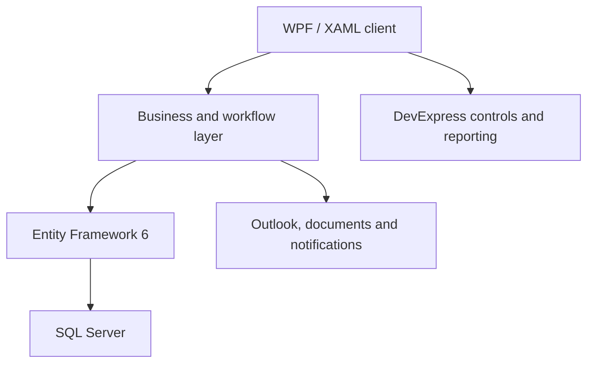

# SmartERP — Enterprise ERP Engineering Case Study

> 6+ years building and supporting a custom multi-company ERP used by **200–250 people across 7–9 businesses**.

[](https://dotnet.microsoft.com/)
[](https://learn.microsoft.com/dotnet/desktop/wpf/)
[](https://learn.microsoft.com/ef/)
[](https://www.microsoft.com/sql-server)
[](#portfolio-scope)
[](https://codespaces.new/talhajavedawan/talhajaved-portfolio?quickstart=1)

## Executive summary

SmartERP connects finance, procurement, inventory, CRM and HR workflows in one business-critical platform. I worked across feature delivery, production support, stakeholder requirements and web modernisation.

| Evidence | Scale |
|---|---:|
| Commercial engineering | 6+ years |
| ERP users | 200–250 |
| Companies supported | 7–9 |
| Desktop screens secured | 100+ |
| Email items integrated | 5,000+ |

## What I delivered

- Built and supported business-critical modules using **C#, .NET Framework, WPF, EF6, SQL Server and DevExpress**.
- Solved complex production issues involving data integrity, performance, memory use and Outlook integration.
- Introduced a **15-minute idle logout across 100+ windows** and supported email integration handling **5,000+ items**.
- Worked with stakeholders from requirements through release and user support.
- Mentored junior developers and led five graduates during the web-modernisation programme.
- Helped shape the move toward **ASP.NET Core, Angular, EF Core, REST APIs, JWT and microservices**.

## Project delivery and quality

- Coordinated five graduate developers on ERP web modernisation, breaking requirements into tasks, tracking progress and supporting delivery through Scrum-style iterations and Trello.
- Worked with stakeholders to clarify requirements, prioritise changes and keep the team aligned with business workflows.
- Used Git for source control and collaboration, with API testing, functional QA and issue investigation before release.
- Supported production releases, user feedback and follow-up fixes across finance and operations modules.

## System at a glance

| Area | Selected capabilities |
|---|---|
| Finance | Bookkeeping, general ledger, chart of accounts, cost accounting, budgets, P&L and reconciliation |
| Treasury | Petty cash, multi-currency, interbank/intercompany transfers and loans |
| Operations | Procurement, contracts, vendors, inventory and asset management |
| Business management | Sales, CRM, HRM, companies, departments and reporting |
| Platform | RBAC, order-based collaboration, notifications, REST APIs and microservice modernisation |

## Product walkthrough

Selected screens show the product, workflows and engineering scope at a glance.

> The production source code and confidential business data are not published. HR screens containing personal-data fields are intentionally omitted.

### Platform overview

#### Unified module navigation


The ribbon-based shell provides a consistent entry point for accountancy, company, customer, vendor, HR, banking, loans, inventory, and document workflows.

### Finance and accounting

#### Chart of accounts and account management


The accounts register supports multiple account types, currencies, balances, reconciliation dates, approval states, and company or department filtering.

#### Currency and exchange-rate management


Exchange-rate registers capture base and transaction currencies, effective periods, audit information, and void status for controlled multi-currency processing.

#### Internal and inter-company bank transfers


The transfer workflow coordinates debit and credit postings, companies, departments, bank accounts, exchange rates, VAT, charges, petty cash, and general-ledger posting dates.

#### Accounting cost sheet


Cost sheets consolidate vendor charges and compare budgeted, adjusted, and system costs and margins to support commercial decisions.

### Sales and customer operations

#### Customer centre


The Customer Centre brings sales and procurement registers into a searchable workspace with date, department, lifecycle, approval, and status filters.

#### End-to-end transaction tracking


The transaction tree traces the full commercial lifecycle—from inquiry and offer to sales order, invoices, receipts, purchase orders, bills, and payments—with status and approval visibility.

### Inventory and reporting

#### Inventory valuation detail


The detail report exposes item, company, department, on-hand quantity, average cost, and values in operating and reporting currencies.

#### Inventory valuation summary


The summary view provides a consolidated inventory valuation with drill-down access to detailed records and print-ready reporting.

### Administration and security

#### Role-based access control


Administrators map users to companies, departments, and roles, then assign fine-grained permissions through a hierarchical capability tree.

### Collaboration and operational awareness

#### Transaction notifications


The in-application inbox groups workflow notifications, tags, comments, status changes, and module references, helping users act without losing transaction context.

## Architecture



The production platform evolved over several years, so the architecture contains both domain-oriented services and legacy areas. My work included stabilising that system while creating a practical path toward a web-based, API-first architecture. See [Architecture](docs/ARCHITECTURE.md) for more detail.

## Engineering highlights

### Reliability in a mature application

I resolved recurring EF6 issues such as duplicate tracked entities, lazy-loading surprises, cross-context entity errors, and expensive object graphs. The work required understanding state management and transaction boundaries rather than simply patching UI symptoms.

### Desktop performance and memory

Long-running ERP sessions exposed memory pressure in complex grids, document previews, and Office integration. I improved object lifetimes, query boundaries, pagination/loading behaviour, and COM release patterns.

### Security and access control

The application used role- and permission-based workflows across companies and departments. Modernisation plans introduced API authentication with JWT and a stronger separation between UI, application logic, and persistence.

### Product and team ownership

My contribution extended beyond coding: stakeholder discussions, prioritisation, production investigation, release support, technical planning, mentoring, and coordinating web-migration work.

## Representative code

The [`src`](src/) directory contains self-contained examples created for this portfolio:

- A deterministic multi-stage approval workflow.
- A cash-flow summary service with explicit domain types.
- Unit tests demonstrating expected behaviour and edge cases.

These examples communicate my current engineering style; they are not copied from the proprietary ERP.

## Documentation

- [Detailed case study](docs/CASE-STUDY.md)
- [Architecture and modernisation path](docs/ARCHITECTURE.md)
- [Selected engineering challenges](docs/ENGINEERING-CHALLENGES.md)
- [Security and confidentiality](SECURITY.md)

## Run the showcase tests

```bash
dotnet test SmartERP.Portfolio.sln
```

The showcase targets .NET 8 and has no external infrastructure dependencies.

## Portfolio scope

This portfolio documents a **custom commercial ERP**. The production implementation remains private, so credentials, customer information, databases, confidential business rules, and proprietary source code are not published. Metrics are approximate and presented only to communicate engineering scale.

## About me

I am a London-based software engineer with 6+ years of experience in **C#, .NET, WPF, SQL Server, enterprise applications and production support**. I have completed an MSc in Software Engineering and am open to UK .NET and enterprise software roles.

[LinkedIn](https://www.linkedin.com/in/talha-javed-013319173/) · [GitHub](https://github.com/talhajavedawan)
