# SmartERP — Enterprise ERP Engineering Case Study

> An engineering portfolio covering 6+ years of hands-on work designing, developing, supporting, and modernising a custom multi-company ERP platform.

[](https://dotnet.microsoft.com/)
[](https://learn.microsoft.com/dotnet/desktop/wpf/)
[](https://learn.microsoft.com/ef/)
[](https://www.microsoft.com/sql-server)
[](#portfolio-scope)
[](https://codespaces.new/talhajavedawan/SmartERP-Portfolio?quickstart=1)

## Executive summary

SmartERP is a bespoke enterprise resource planning platform that supported approximately **200–250 users** across **multiple companies and international operations**. Its connected modules cover bookkeeping, procurement, inventory, general-ledger and chart-of-accounts management, cost and current accounting, budgeting, profit and loss, reconciliation, treasury, loans, HRM, CRM, vendor and asset management. I worked across its lifecycle: requirements analysis, product design, C# development, database modelling, production support, performance improvement, mentoring, and modernisation planning.

This repository is a recruiter-friendly engineering portfolio for the custom ERP. It demonstrates the engineering decisions, system scope, representative challenges, and selected portfolio code examples while the commercial production source and confidential business data remain private.

## What I delivered

- Developed and maintained connected bookkeeping, procurement, inventory, ledger, chart-of-accounts, cost-accounting, budgeting, profit-and-loss, reconciliation, petty-cash, loan, HRM, CRM, vendor, asset, document, notification, and reporting workflows.
- Built desktop features with **C#, .NET Framework, WPF/XAML, DevExpress, EF6, and SQL Server**.
- Supported a multi-company deployment used by roughly **200–250 users**.
- Diagnosed complex production problems involving Entity Framework tracking, memory pressure, long-running UI sessions, self-referencing trees, and Microsoft Office interop.
- Designed a **15-minute idle-session logout** mechanism across more than 100 application windows.
- Implemented Outlook integration for inboxes, sent items, folders, attachments, HTML previews, and unread state at a scale of thousands of messages.
- Delivered dashboards including cash-flow summaries and operational notifications.
- Mentored junior developers and led a small graduate team during the web-modernisation programme.
- Planned the transition toward **ASP.NET Core Web API, REST APIs, Angular, EF Core, JWT authentication, microservices, and tenant-aware architecture**.

## System at a glance

| Area | Capabilities |
|---|---|
| Bookkeeping and ledger | General ledger, chart of accounts, debit/credit postings, journal vouchers, current accounts, VAT, trial balance, profit and loss |
| Treasury and reconciliation | Account reconciliation, petty cash, multi-currency transactions, interbank and intercompany transfers |
| Loans and finance | Short-term loans, company loans, employee loans, advances, cash-flow reporting and budget calculations |
| Procurement and costing | Purchase orders, invoices, bills, approvals, vendor management, contract workflows, administrative expenses and cost accounting |
| Sales and CRM | Sales orders, invoices, receipts, customer workflows, CRM integration and reporting |
| Inventory and assets | Item records, stock movements, inventory valuation, asset management and operational reporting |
| People and organisation | HRM integration, employees, companies, departments and organisational mapping |
| Collaboration and platform | Internal order-based chat, notifications, documents, RBAC, REST APIs and microservice-oriented modernisation |

## Product walkthrough

The following gallery presents representative screens from the mature SmartERP desktop application. The screenshots use demonstration records and are organised by business capability so recruiters can quickly assess the product's breadth and the engineering involved.

> The production source code and confidential business data are not published. HR screens containing personal-data fields are intentionally omitted.

### Platform overview

#### Unified module navigation

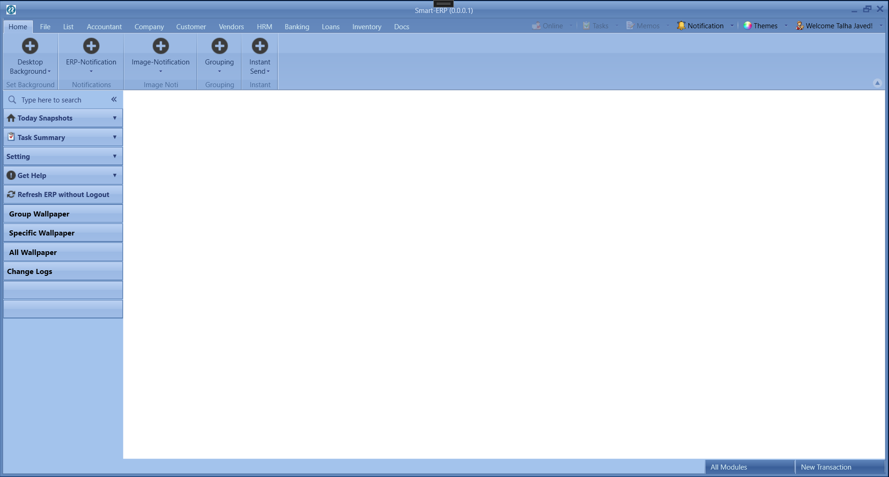

The ribbon-based shell provides a consistent entry point for accountancy, company, customer, vendor, HR, banking, loans, inventory, and document workflows.

### Finance and accounting

#### Chart of accounts and account management

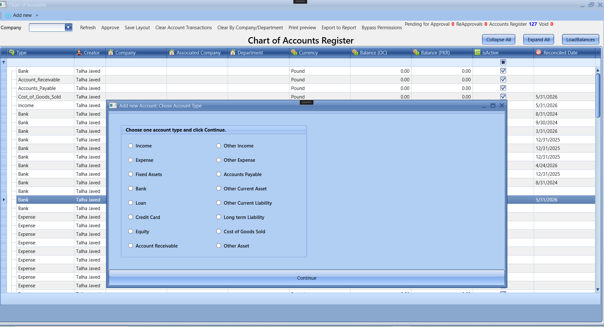

The accounts register supports multiple account types, currencies, balances, reconciliation dates, approval states, and company or department filtering.

#### Currency and exchange-rate management

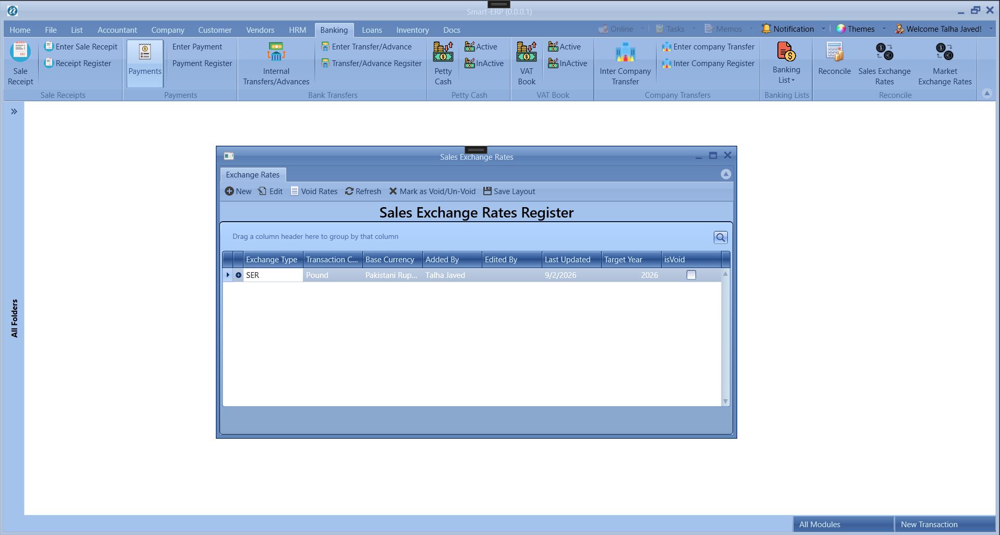

Exchange-rate registers capture base and transaction currencies, effective periods, audit information, and void status for controlled multi-currency processing.

#### Internal and inter-company bank transfers

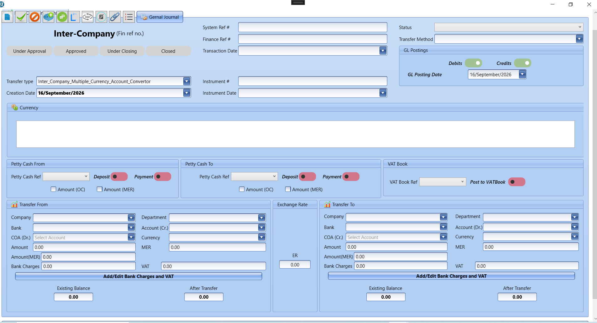

The transfer workflow coordinates debit and credit postings, companies, departments, bank accounts, exchange rates, VAT, charges, petty cash, and general-ledger posting dates.

#### Accounting cost sheet

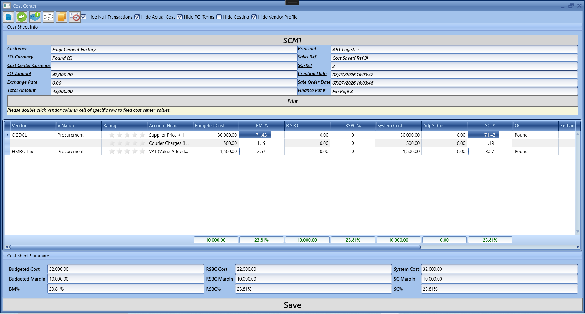

Cost sheets consolidate vendor charges and compare budgeted, adjusted, and system costs and margins to support commercial decisions.

### Sales and customer operations

#### Customer centre

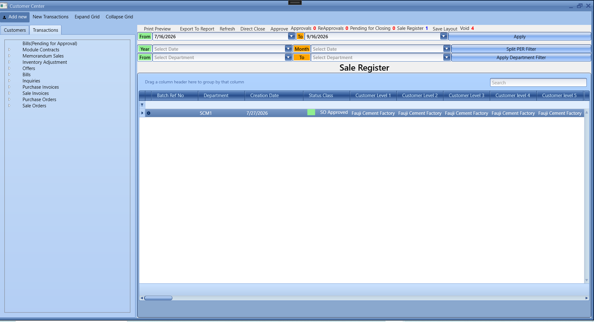

The Customer Centre brings sales and procurement registers into a searchable workspace with date, department, lifecycle, approval, and status filters.

#### End-to-end transaction tracking

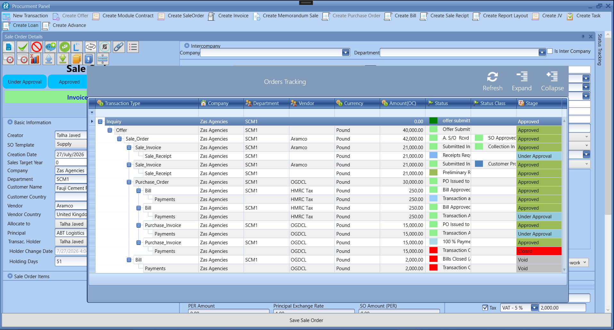

The transaction tree traces the full commercial lifecycle—from inquiry and offer to sales order, invoices, receipts, purchase orders, bills, and payments—with status and approval visibility.

### Inventory and reporting

#### Inventory valuation detail

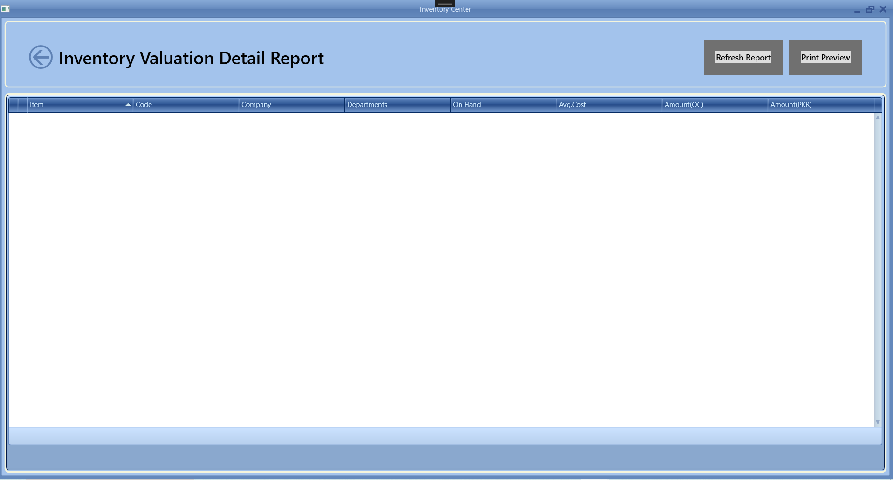

The detail report exposes item, company, department, on-hand quantity, average cost, and values in operating and reporting currencies.

#### Inventory valuation summary

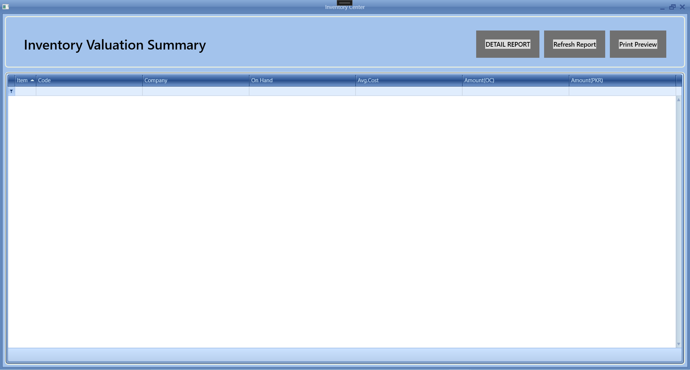

The summary view provides a consolidated inventory valuation with drill-down access to detailed records and print-ready reporting.

### Administration and security

#### Role-based access control


Administrators map users to companies, departments, and roles, then assign fine-grained permissions through a hierarchical capability tree.

### Collaboration and operational awareness

#### Transaction notifications

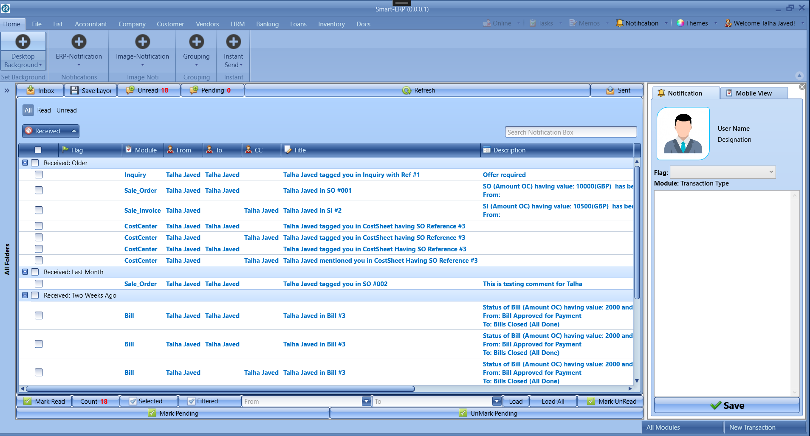

The in-application inbox groups workflow notifications, tags, comments, status changes, and module references, helping users act without losing transaction context.

## Architecture

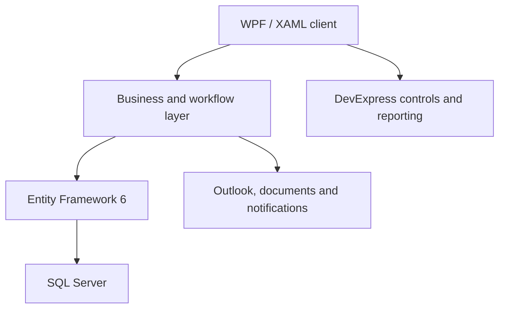

The production platform evolved over several years, so the architecture contains both domain-oriented services and legacy areas. My work included stabilising that system while creating a practical path toward a web-based, API-first architecture. See [Architecture](docs/ARCHITECTURE.md) for more detail.

## Engineering highlights

### Reliability in a mature application

I resolved recurring EF6 issues such as duplicate tracked entities, lazy-loading surprises, cross-context entity errors, and expensive object graphs. The work required understanding state management and transaction boundaries rather than simply patching UI symptoms.

### Desktop performance and memory

Long-running ERP sessions exposed memory pressure in complex grids, document previews, and Office integration. I improved object lifetimes, query boundaries, pagination/loading behaviour, and COM release patterns.

### Security and access control

The application used role- and permission-based workflows across companies and departments. Modernisation plans introduced API authentication with JWT and a stronger separation between UI, application logic, and persistence.

### Product and team ownership

My contribution extended beyond coding: stakeholder discussions, prioritisation, production investigation, release support, technical planning, mentoring, and coordinating web-migration work.

## Representative code

The [`src`](src/) directory contains small clean-room examples written specifically for this portfolio:

- A deterministic multi-stage approval workflow.
- A cash-flow summary service with explicit domain types.
- Unit tests demonstrating expected behaviour and edge cases.

These examples communicate my current engineering style; they are not copied from the proprietary ERP.

## Documentation

- [Detailed case study](docs/CASE-STUDY.md)
- [Architecture and modernisation path](docs/ARCHITECTURE.md)
- [Selected engineering challenges](docs/ENGINEERING-CHALLENGES.md)
- [Security and confidentiality](SECURITY.md)

## Run the showcase tests

```bash
dotnet test SmartERP.Portfolio.sln
```

The showcase targets .NET 8 and has no external infrastructure dependencies.

## Portfolio scope

This portfolio documents a **custom commercial ERP**. The production implementation remains private, so credentials, customer information, databases, confidential business rules, and proprietary source code are not published. Metrics are approximate and presented only to communicate engineering scale.

## About me

I am a London-based software engineer and technical product professional with more than six years of commercial experience, specialising in **C#, .NET, WPF, SQL Server, enterprise applications, production support, and system modernisation**. I have completed an MSc in Software Engineering and am open to UK opportunities in .NET development, application development, and technical product engineering.

[LinkedIn](https://www.linkedin.com/in/talha-javed-013319173/) · [GitHub](https://github.com/talhajavedawan)
