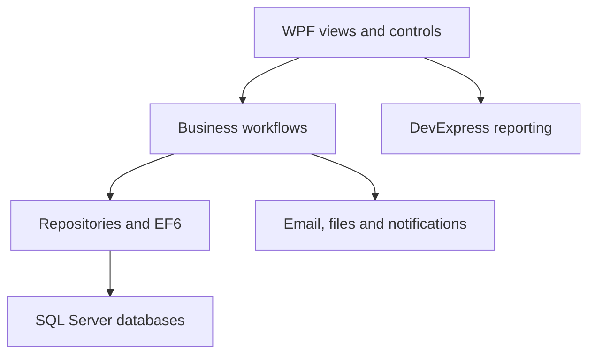
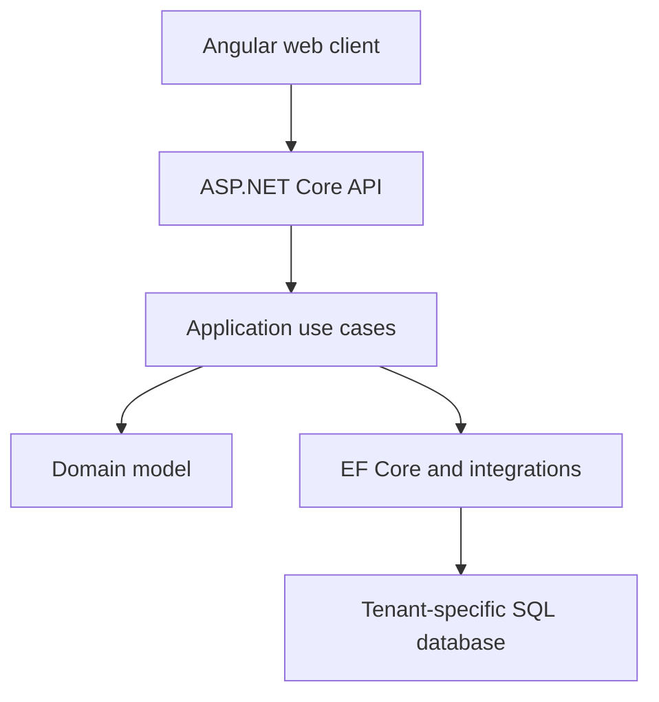

# Architecture and modernisation

## Established desktop architecture

### Presentation

The Windows client uses WPF/XAML with DevExpress controls for data grids, navigation, printing, charts, and reports. The mature application contains a mixture of code-behind and MVVM-oriented components, reflecting its incremental evolution.

### Business and data access

C# domain entities, workflow services, repositories, and EF6 provide the core behaviour. SQL Server supplies transactional persistence and reporting data.

### Integrations

The system integrates with Microsoft Office/Outlook, document storage, notification services, and external communication features. These boundaries require careful resource cleanup and failure handling.

## Key architectural concerns

- Entity lifetime and EF tracking across long-running desktop screens.
- Permission-aware workflows spanning departments and companies.
- Large data sets rendered through feature-rich desktop controls.
- Backward compatibility during frequent operational change.
- Isolation of configuration and credentials from source control.
- Reliable interop with external desktop applications.

## Target web architecture

The migration strategy uses bounded vertical slices rather than rewriting every module simultaneously:

1. Establish identity, JWT authentication, roles, and tenant resolution.
2. Move stable administrative capabilities first.
3. Introduce application-layer use cases with explicit contracts.
4. Migrate business modules incrementally behind APIs.
5. Add automated tests, observability, containerised builds, and deployment pipelines.

## Engineering trade-offs

| Decision | Benefit | Trade-off |
|---|---|---|
| Incremental migration | Lower operational risk | Temporary coexistence of two architectures |
| Tenant-specific databases | Stronger data isolation | More provisioning and migration coordination |
| API-first boundary | Enables multiple clients and testing | Requires contract/version discipline |
| Preserve proven rules | Reduces business regression | Legacy rules must be carefully rediscovered |

## Security direction

- Secrets supplied through environment-specific configuration or a managed secret store.
- Passwords protected using modern adaptive hashing rather than general-purpose hashes.
- Least-privilege database accounts rather than administrative credentials.
- Central authentication and explicit authorisation policies.
- Audit events for sensitive financial and administrative actions.
- Automated dependency and secret scanning in CI.
